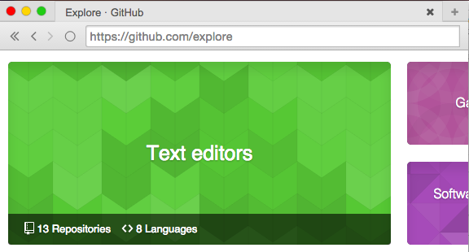

# electron-browser

A browser ui for electron, written in react.
To use it in your project, I recommend forking or cloning this repo.



**Install instructions**

To run this code, follow these steps:

```
git clone https://github.com/pfrazee/electron-browser
cd electron-browser
npm install -d
npm start
```

**-- Plug --**

If you're looking for an actively maintained electron-based browser with lots more features, check out [Beaker](https://github.com/beakerbrowser/beaker), my followup project.

## License

MIT
